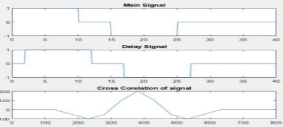
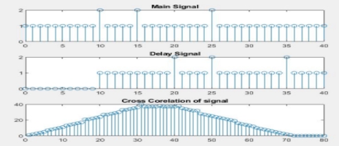

**Date: 21-5-23** 

**Experiment No :** 4 

## Experiment Name  Study of time delay of a signal and cross correlation of the given signal and the delayed signal 

**Theory :**  

Cross correlation :  

This is a kind of correlation, in which the signal in-hand is correlated with another signal so as to know how much resemblance exists between them.  

Time Delay measuring using cross correlation : 

|Let us assume that a signal sent is sent from a transmitter, shown in Figure 4a. The signal arrives
at the receiver after being delayed by an unknown interval of time, as shown in Figure 4b.
Now, suppose that we need to find this delay, which is a result of being transmitted over the 
communication channel. This objective can be achieved by cross-correlating the signal sent with
the signal received.
|||
***Figure 4.1***:Signal (a) sent and (b) received on a communication channel*||
The result obtained is shown in Figure 5, which clearly exhibits a peak at time *t* = 10. This means that the received signal matches with the test signal the best when the test signal is shifted by!
10 units along the time-axis. 

  

**Figure 4.2** : Cross-correlation of the signals shown in Figure 4.1* Z- transform : 

The Z-transform (ZT) is a mathematical tool which is used to convert the difference equations in time domain into the algebraic equations in z-domain. The Z-transform is a very useful tool in the analysis of a linear shift invariant (LSI) system. 

The Z-transform may be of two types viz. unilateral (or one-sided) **and** bilateral** (or two-sided)**.** Mathematically, if x(n) is a discrete-time signal or sequence, then its bilateral or two-sided Z -

transform is defined as − 

**Used Software :**  

1\.  MATLAB  

Time Delay  Delay using cross corelation 

~~~
clc 

` `clear all 

` `t=0:0.1:40 

` `x1=(t>=0 & t<=10); 

` `x2=(t>=10 & t<=15); 

` `x3=(t>=15 & t<=25); 

` `x4=(t>=25 & t<=40); 

` `signal1 = 1\*x1+0\*x2-1\*x3+0\*x4;  subplot(3,1,1); 

` `plot(t,signal1); 

` `title("Main Signal"); 

` `delay = 2; 

` `x5=(t>=0+delay & t<=10+delay);  x6=(t>=10+delay & t<=15+delay);  x7=(t>=15+delay & t<=25+delay);  x8=(t>=25+delay & t<=40+delay);  signal2 = 1\*x5+0\*x6-1\*x7+0\*x8;  subplot(3,1,2); 

` `plot(t,signal2); 

` `title('Delay Signal'); 

` `signal3 = xcorr(signal1,signal2); 

` `subplot(3,1,3); 

` `plot(signal3); 

` `xlim([0 800]); 

` `title('Cross Corelation of signal'); 

[~, max\_index] = max(signal3); 

` `delay\_time =(length(signal1)-max\_index);  disp('Delay Time'); 

` `disp(delay\_time\*0.1);  
~~~
Output : 

Cross correlation for descrete time delay : 

clc 
~~~
` `clear all 

` `t=0:2:40 

` `x1=(t>=0 & t<=10); 

` `x2=(t>=10 & t<=15); 

` `x3=(t>=15 & t<=25); 

` `x4=(t>=25 & t<=40); 

` `signal1 = x1+x2+x3+x4 

` `subplot(3,1,1); 

` `stem(t,signal1); 

` `title("Main Signal"); 

` `delay = 10; 

` `x5=(t>=0+delay & t<=10+delay); 

` `x6=(t>=10+delay & t<=15+delay); 

` `x7=(t>=15+delay & t<=25+delay); 

` `x8=(t>=25+delay & t<=40+delay); 

` `signal2 = x5+x6+x7+x8 

` `subplot(3,1,2); 

` `stem(t,signal2); 

` `title('Delay Signal'); 

` `signal3 = xcorr(signal1,signal2); 

` `subplot(3,1,3); 

` `stem(signal3); 

` `xlim([0 40]); 

` `title('Cross Corelation of signal'); 

[~, max\_index] = max(signal3); 

` `delay\_time =(length(signal1)-max\_index); 

~~~
Output : 

Z transform code: 

~~~
clc

close all

clear all

x=[5 6 7 8 9 10] l=length(x);

X=0;

z=sym('z');

for i=0:l-1

`    `X=X+x(i+1)\*z^(-i) end

disp('Display Output'); disp(X);

~~~
Output : 

## Discussion and conclusion : 

I initially plotted the primary signal, after which I plotted that signal using the time delay value. 

After correlating the two signals (main and time-delayed) using the built-in cross correlation function, I plotted the results. Then, as predicted by the theory, we discovered our outcome. As I discovered 

The experiment was successful since the results were in line with the theory.

##  Referrence : 

1. [https://www.tutorialspoint.com/what-is-z-transform ](https://www.tutorialspoint.com/what-is-z-transform)
1. [https://www.youtube.com/watch?v=KFMEibnOk3Y ](https://www.youtube.com/watch?v=KFMEibnOk3Y)
1. [https://www.allaboutcircuits.com/technical-articles/understanding-correlation/ ](https://www.allaboutcircuits.com/technical-articles/understanding-correlation/)
